## Página Web de Estudio Fotográfico

## Página de Inicio y Autenticación

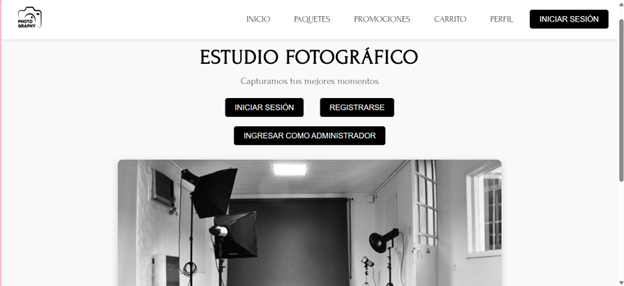

La aplicación cuenta con una página de inicio donde se presentan los servicios del estudio fotográfico y se permite el acceso tanto a clientes como al administrador.

Para acceder a la plataforma, tanto clientes como administradores deben iniciar sesión con su usuario y contraseña únicos. El administrador tiene acceso a la gestión del sistema, mientras que los clientes pueden explorar paquetes y realizar compras.

Página de inicio y formulario de login del usuario:

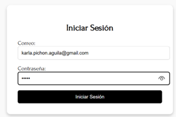

Página de inicio y formulario de login del administrador:

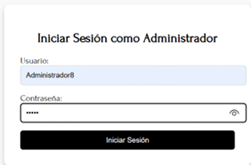
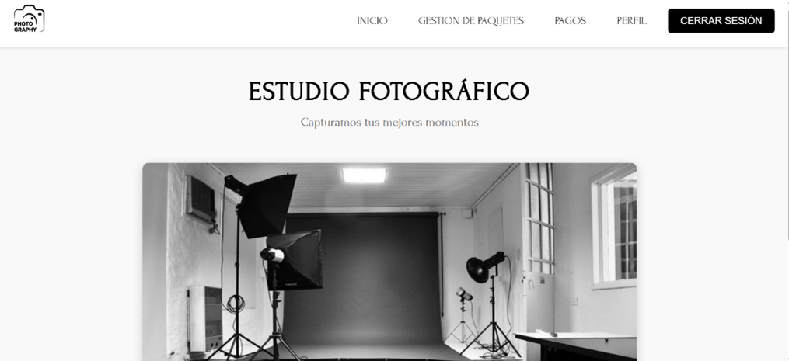

---

## Módulo de Gestión de Paquetes (Administrador)

El administrador cuenta con un módulo exclusivo donde puede visualizar, agregar, editar y eliminar paquetes de servicios fotográficos.

- **Visualización de paquetes:** Se muestra una lista con los paquetes disponibles, junto con información clave como precio y descripción.
  
  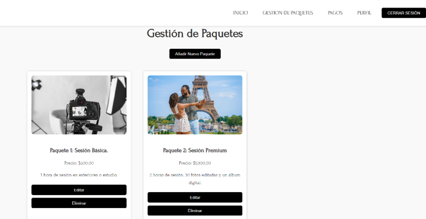
  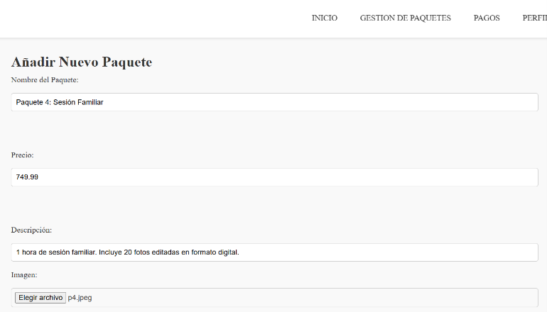

- **Edición y eliminación:** Los paquetes pueden modificarse o eliminarse según las necesidades del estudio.
  
  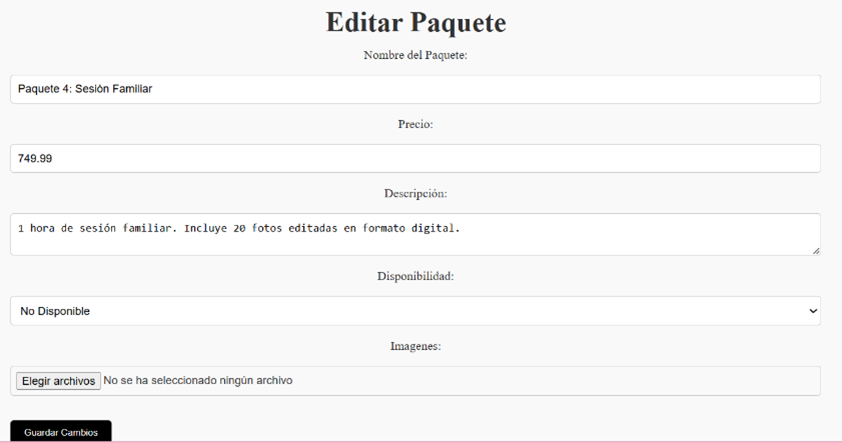
  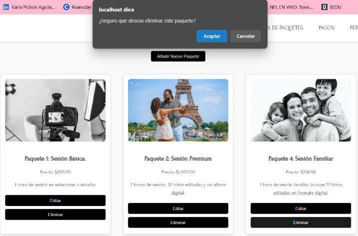

---

## Página de Usuario y Selección de Paquetes

Los clientes pueden explorar los diferentes paquetes de fotografía disponibles en la plataforma.

- **Página de paquetes:** Se presentan los servicios disponibles con imágenes, precios y detalles.
- **Agregar al carrito:** Los clientes pueden seleccionar los paquetes que desean y añadirlos al carrito de compras.
  
  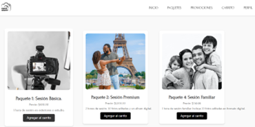
  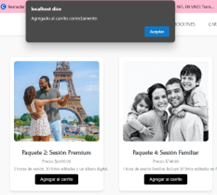

---

## 🛒 Carrito de Compras

En la sección de carrito, los clientes pueden administrar los paquetes seleccionados antes de completar la compra.

- **Visualización de productos en el carrito.**
- **Opción para eliminar paquetes individuales o vaciar todo el carrito.**
  
  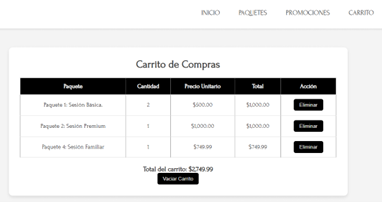
  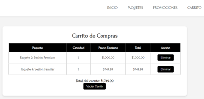
  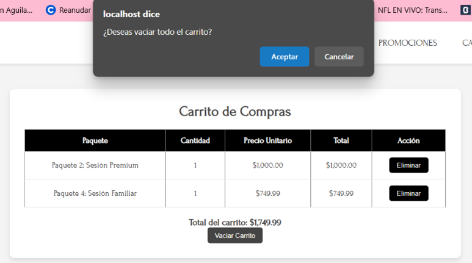
  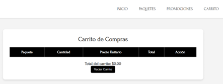

---

## Perfil del Usuario

Cada usuario cuenta con un perfil donde puede visualizar y actualizar su información personal.

- **Visualización y edición de información básica como nombre, correo y teléfono.**
  
  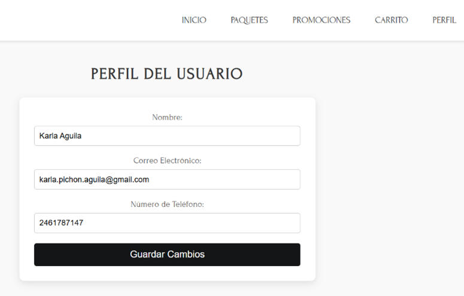
  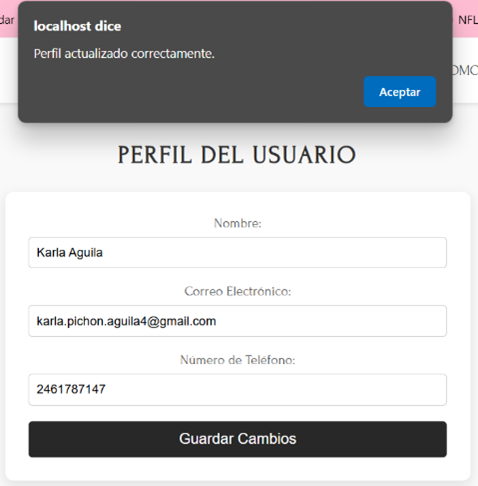

